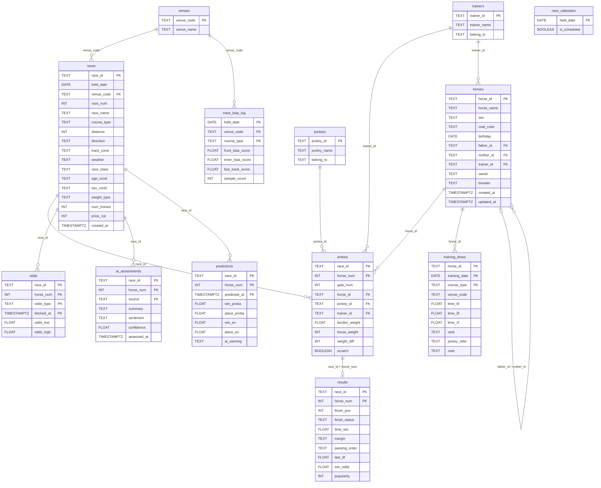

# DB スキーマ定義書

関連 Issue: #2

---

## ER 図



---

## テーブル定義一覧

### venues（競馬場マスタ）

JRA 10 場の固定マスタ。`init.sql` で初期データを INSERT する。

| カラム名 | 型 | PK | 制約 | 説明 |
|--------|---|----|----|-----|
| venue_code | TEXT | ✅ | NOT NULL | JRA 場コード（例: "05"=東京） |
| venue_name | TEXT | | NOT NULL | 競馬場名（例: "東京"） |

**初期データ（JRA 10 場）:**

| venue_code | venue_name |
|-----------|-----------|
| 01 | 札幌 |
| 02 | 函館 |
| 03 | 福島 |
| 04 | 新潟 |
| 05 | 東京 |
| 06 | 中山 |
| 07 | 中京 |
| 08 | 京都 |
| 09 | 阪神 |
| 10 | 小倉 |

---

### races（レース基本情報）

1 行 = 1 レース。netkeiba の `race_id` を主キーとして使用。

| カラム名 | 型 | PK | FK | 説明 |
|--------|---|----|----|-----|
| race_id | TEXT | ✅ | | netkeiba race_id（例: 202305010101） |
| held_date | DATE | | | 開催日 |
| venue_code | TEXT | | venues | 競馬場コード |
| race_num | INT | | | 第 N 競走 |
| race_name | TEXT | | | レース名 |
| course_type | TEXT | | | `'芝'` / `'ダート'`（障害は除外） |
| distance | INT | | | 距離（メートル） |
| direction | TEXT | | | `'右'` / `'左'` / `'直線'` |
| track_cond | TEXT | | | `'良'` / `'稍重'` / `'重'` / `'不良'` |
| weather | TEXT | | | 天気 |
| race_class | TEXT | | | `'1勝クラス'` / `'G1'` / `'オープン'` など |
| age_cond | TEXT | | | 年齢条件（例: `'3歳以上'`） |
| sex_cond | TEXT | | | 性別条件 |
| weight_type | TEXT | | | `'馬齢'` / `'ハンデ'` / `'別定'` |
| num_horses | INT | | | 出走頭数 |
| prize_1st | INT | | | 1 着賞金（万円） |
| created_at | TIMESTAMPTZ | | | レコード作成日時 |

**race_id の構造:**
```
202305010101
└─┬─┘└┬┘└┬┘└┬┘
  年  場  回  日  R
```

---

### horses（馬マスタ）

1 行 = 1 頭。`father_id` / `mother_id` が同テーブルの自己参照になっている点に注意。

| カラム名 | 型 | PK | FK | 説明 |
|--------|---|----|----|-----|
| horse_id | TEXT | ✅ | | netkeiba の馬 ID |
| horse_name | TEXT | | | 馬名 |
| sex | TEXT | | | `'牡'` / `'牝'` / `'セ'` |
| coat_color | TEXT | | | 毛色 |
| birthday | DATE | | | 生年月日 |
| father_id | TEXT | | horses（自己参照） | 父馬 ID |
| mother_id | TEXT | | horses（自己参照） | 母馬 ID |
| trainer_id | TEXT | | trainers | 担当調教師 |
| owner | TEXT | | | 馬主名 |
| breeder | TEXT | | | 生産者名 |
| created_at | TIMESTAMPTZ | | | レコード作成日時 |
| updated_at | TIMESTAMPTZ | | | レコード更新日時 |

---

### jockeys（騎手マスタ）

| カラム名 | 型 | PK | 説明 |
|--------|---|----|----|
| jockey_id | TEXT | ✅ | netkeiba の騎手 ID |
| jockey_name | TEXT | | 騎手名 |
| belong_to | TEXT | | `'関東'` / `'関西'` / `'地方'` / `'外国'` |

---

### trainers（調教師マスタ）

| カラム名 | 型 | PK | 説明 |
|--------|---|----|----|
| trainer_id | TEXT | ✅ | netkeiba の調教師 ID |
| trainer_name | TEXT | | 調教師名 |
| belong_to | TEXT | | `'関東'` / `'関西'` |

---

### entries（出走馬エントリー）

1 行 = 1 頭 × 1 レース。主キーは `(race_id, horse_num)` の複合キー。

| カラム名 | 型 | PK | FK | 説明 |
|--------|---|----|----|-----|
| race_id | TEXT | ✅ | races | レース ID |
| horse_num | INT | ✅ | | 馬番 |
| gate_num | INT | | | 枠番（1〜8） |
| horse_id | TEXT | | horses | 馬 ID |
| jockey_id | TEXT | | jockeys | 騎手 ID |
| trainer_id | TEXT | | trainers | 調教師 ID |
| burden_weight | FLOAT | | | 斤量（kg） |
| horse_weight | INT | | | 馬体重（kg） |
| weight_diff | INT | | | 前走比（+/-） |
| scratch | BOOLEAN | | | 取消・除外フラグ（default: false） |

---

### results（レース結果）

1 行 = 1 頭 × 1 レースの結果。`entries` と同じ複合主キー。

| カラム名 | 型 | PK | FK | 説明 |
|--------|---|----|----|-----|
| race_id | TEXT | ✅ | entries | レース ID |
| horse_num | INT | ✅ | entries | 馬番 |
| finish_pos | INT | | | 着順（0 = 完走できず） |
| finish_status | TEXT | | | `'完走'` / `'除外'` / `'中止'` / `'失格'` |
| time_sec | FLOAT | | | タイム（秒） |
| margin | TEXT | | | 着差（例: `'クビ'` `'1/2'`） |
| passing_order | TEXT | | | 通過順（例: `"3-3-2-1"`） |
| last_3f | FLOAT | | | 上がり 3F タイム（秒） |
| win_odds | FLOAT | | | 確定単勝オッズ |
| popularity | INT | | | 人気順位 |

---

### odds（オッズスナップショット）

1 行 = 1 頭 × 1 レース × 馬券種別 × 取得時刻。複数回取得することでオッズの変動を記録する。

| カラム名 | 型 | PK | FK | 説明 |
|--------|---|----|----|-----|
| race_id | TEXT | ✅ | races | レース ID |
| horse_num | INT | ✅ | | 馬番 |
| odds_type | TEXT | ✅ | | `'win'`（単勝）/ `'place'`（複勝） |
| fetched_at | TIMESTAMPTZ | ✅ | | 取得日時 |
| odds_low | FLOAT | | | オッズ下限（複勝は下限・単勝はこちらを使用） |
| odds_high | FLOAT | | | オッズ上限（複勝のみ。単勝は NULL） |

---

### training_times（調教タイム）

レース前の調教記録。主キーは `(horse_id, training_date, course_type)` の複合キー。

| カラム名 | 型 | PK | FK | 説明 |
|--------|---|----|----|-----|
| horse_id | TEXT | ✅ | horses | 馬 ID |
| training_date | DATE | ✅ | | 調教日 |
| course_type | TEXT | ✅ | | `'坂路'` / `'CW'` / `'DP'` / `'芝'` |
| venue_code | TEXT | | | 調教場（`'栗東'` / `'美浦'` など） |
| time_4f | FLOAT | | | 4F タイム（秒） |
| time_3f | FLOAT | | | 3F タイム（秒） |
| time_1f | FLOAT | | | ラスト 1F タイム（秒） |
| rank | TEXT | | | 追い切り評価（例: `'◎'` `'○'` `'△'`） |
| jockey_rider | TEXT | | | 騎乗した騎手名（調教で騎乗した場合） |
| note | TEXT | | | メモ |

---

### track_bias_log（トラックバイアスログ）

当日の馬場傾向を集計したもの。レース後に自動計算して保存する。

| カラム名 | 型 | PK | FK | 説明 |
|--------|---|----|----|-----|
| held_date | DATE | ✅ | | 開催日 |
| venue_code | TEXT | ✅ | venues | 競馬場コード |
| course_type | TEXT | ✅ | | `'芝'` / `'ダート'` |
| front_bias_score | FLOAT | | | 先行有利度（当日 1〜3 着馬の 4 コーナー通過順位平均） |
| inner_bias_score | FLOAT | | | 内枠有利度（当日 1〜3 着馬の枠番平均） |
| fast_track_score | FLOAT | | | タイム傾向（基準タイムとの差） |
| sample_count | INT | | | 集計に使ったレース数（信頼度の指標） |

---

### ai_assessments（AI 掲示板評価）

Claude API による netkeiba 掲示板の解析結果。

| カラム名 | 型 | PK | FK | 説明 |
|--------|---|----|----|-----|
| race_id | TEXT | ✅ | races | レース ID |
| horse_num | INT | ✅ | | 馬番 |
| source | TEXT | ✅ | | データソース（現在は `'netkeiba_bbs'` のみ） |
| summary | TEXT | | | AI が生成した要約文 |
| sentiment | TEXT | | | `'positive'` / `'neutral'` / `'negative'` |
| confidence | FLOAT | | | 判定の確信度（0.0〜1.0） |
| assessed_at | TIMESTAMPTZ | | | 解析日時 |

---

### predictions（予測結果）

モデルの推論結果と期待値。Discord 通知・Web アプリ両方からこのテーブルを参照する。

| カラム名 | 型 | PK | FK | 説明 |
|--------|---|----|----|-----|
| race_id | TEXT | ✅ | races | レース ID |
| horse_num | INT | ✅ | | 馬番 |
| predicted_at | TIMESTAMPTZ | ✅ | | 予測実行日時（複数回の予測を記録） |
| win_proba | FLOAT | | | 単勝予測確率 |
| place_proba | FLOAT | | | 複勝予測確率 |
| win_ev | FLOAT | | | 単勝期待値（`win_proba × win_odds`） |
| place_ev | FLOAT | | | 複勝期待値（`place_proba × odds_low`） |
| ai_warning | TEXT | | | AI 警告文（なければ NULL） |

---

### race_calendars（開催カレンダー）

スケジューラが「今週開催があるか」を判定するために使用する。

| カラム名 | 型 | PK | 説明 |
|--------|---|----|----|
| held_date | DATE | ✅ | 開催日 |
| is_scheduled | BOOLEAN | | 開催予定フラグ（default: false） |
